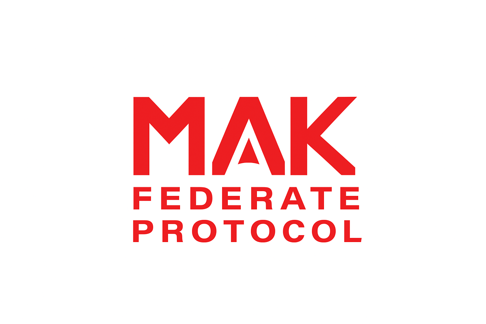

# FederateProtocol_Python

This code should be usable with any RTI that has a federate protocol server.
A Python implementation of the HLA (High Level Architecture) Federate Protocol. The HLA1516_2025/RTI module is a python representation of the HLA4 API (partially defined). The libsrc/fedPro module implements the Federate Protocol network messages. The libsrc/FedProProtobuf module is the protobuf encodings of the service calls, callbacks, and their parameters. The fedProWrapper module is a wrapper around the exchange of Federate Protocol messages that implements the HLA1516_2025/RTI API using the Federate Protocol.
There are 2 example federates that use the HLA1516_2025/RTI API to demonstrate the use of the HLA Federate Protocol.
In order to use the HLA Federate Protocol, the federates must connect to a Federate Protocol server. The MAK RTI provides an implementation of a Federate Protocol Server.

## How To Build
1. Install python (made with python 3.13.3) and add to PATH
2. Go to FederateProtocol Python directory and run Create_Env.bat
3. Activate the environment (by going on commandline, running *EnvName*\scripts\activate)
4. run examples

## How To Run

### Basic Usage
"python examples\simpleFedPro\rtiSimple_FedPro.py"
or
"python examples\hla_bounce\hlaBounce_FedPro.py"

### With Custom Parameters
python examples\simpleFedPro\rtiSimple_FedPro.py -F MyFederation -t Aircraft -m MyFOM.xml\

## Project Structure
`FederateProtocol_Python`/
- `Compile_PYC.py`                 | Python script for generating project bytecode in the bin directory USAGE: "python Compile_PYC.py" |
- `Create_Env.bat`                 | Batch script for generating python environment with the proper libraries installed USAGE: "Create_Env {Environment Name}" (Name is optional) |
- `Bin`/                           | Bin folder for holding pyc bytecode |
- `HLA1516_2025`/                  | Python implementations of HLA standard files |
    * `RTI`
        + `enums.py`
        + `exception.py`
        + `federateAmbassador.py`
        + `federateData.py`
        + `handles.py`
        + `rtiAmbassador.py`
        + `rtiConfiguration.py`
        + `typedefs.py`
- `libsrc`/
    * `fedPro`/                   | FedPro protocol message handling |
        + `callbackRequestMessage.py`      | Requests sent by server to initiate a Callback in FedPro Client |
        + `callbackResponseMessage.py`     | Responses sent by FedPro client to indicate result of a callback Request |
        + `callRequestMessage.py`          | Requests sent by FedPro client to initiate HLA service |
        + `callResponseMessage.py`         | Responses received by server after callRequest |
        + `fedProMessage.py`               | Base message class for all FedPro Messsaging |
        + `heartBeatMessage.py`            | FedPro message used to stimulate connection while messages aren't being sent |
        + `heartBeatResponseMessage.py`    | FedPro Response to HeartBeat message |
        + `newSessionMessage.py`           | FedPro message used to initiate a session with the FedPro Server |
        + `newSessionStatusMessage.py`     | FedPro message used in response to NewSession Message |
    * `fedProProtobuf`/           | Protocol buffer definitions |
        + `datatypes_pb2.py`               | FedPro generated python code for HLA datatypes |
        + `FederateAmbassador_pb2.py`      | FedPro generated python code for Callback related messages/Federate data |
        + `RTIambassador_pb2.py`           | FedPro generated python code for Call related messages/RTI data |
    * `fedProWrapper`/            | RTI/Federate Ambassador wrapper for fedPro->HLA messaging |
        + `federateAmbassadorFedPro.py`    | FedPro Federate Ambassador Implementation |
        + `rtiAmbassadorFedPro.py`         | RTI ambassador Implementation |
        + `fedProMessageHandler.py`        | Sends/Gets Message data and handles accordingly  |
    * `rtiUtil`/                  | RTI utilities and enums |      
        + `enums.py`
        + `exception.py`
        + `logger.py`
        + `msgSocket.py`
- `example`
    * `hlabounce`/               | HLA bounce related files |
        + `hlaBounce_FedPro.py`            | HLA Bounce main entry point |
        + `BallController.py`              | HLA Bounce simple federate implementation |
        + `BallData.py`                    | Class for holding/maintaining ball data |
        + `hlaBounceFederateAmbassador.py` | Federate Ambassador implementation for HLA Bounce |
        + `hlaBounceGui.py`                | Qt implementation for HLA Bounce GUI |
    * `simpleFedPro`/           | Simple federate implementation |
        + `rtiSimple_FedPro.py`            | Simple Fedpro main entry point |
        + `simpleFederate.py`              | Federate implementation |
        + `simpleFederateAmbassador.py`    | Federate Ambassador implementation |

### Command Line Options
- `-F <federation_name>` - Federation execution name (default: MAKsimple)
- `-t <federate_type>` - Federate type (default: Aircraft)  
- `-m <fom_module>` - Add FOM module file
- `-c` - Clear FOM module list
- `-i` - Use immediate callback mode
- `-u` - Subscribe to interactions universally
- `-o` - Use MOM (Management Object Model)
- `-p <password>` - Set password
- `-n <config_name>` - RTI configuration name
- `-r <rti_address>` - RTI address
- `-a <additional_settings>` - Additional RTI settings
- `-h` - Show help message

## Dependencies

- Python 3.7.13
- Protocol Buffers (protobuf)
- HLA 1516-2025 RTI (MAK RTI or compatible)
- Python Library dependencies:
 * google
 * PyQt5
 * protobuf (3.17.3)